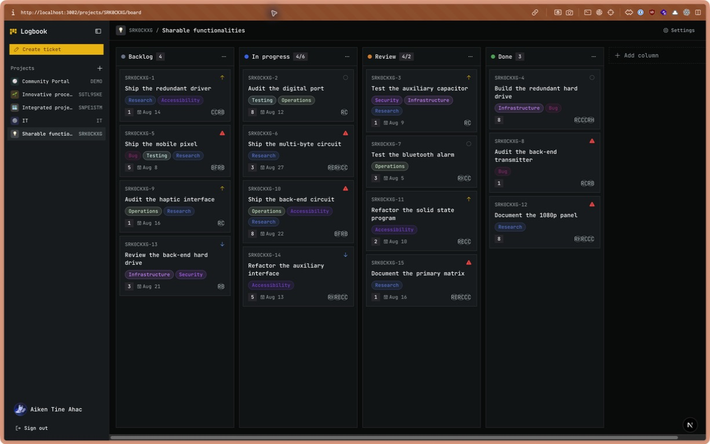
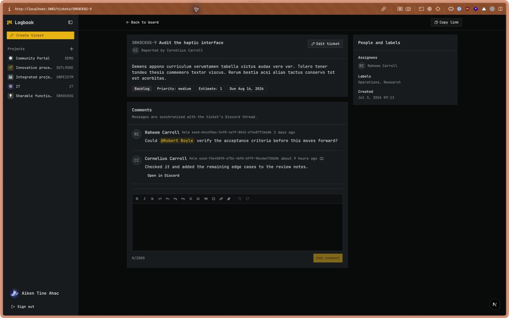

# Logbook

Logbook is a project and ticket workspace for Mladi Pirati. It combines
Kanban-style planning, detailed ticket discussions, member data from Helm, and
optional Discord synchronization in one application.



_Screenshots show one representative workspace; `db:seed` generates new values
on every run._

## What it does

- Organizes projects into configurable, drag-and-drop boards
- Tracks ticket priority, estimates, due dates, assignees, and labels
- Gives every ticket a readable URL such as `/tickets/DEMO-4`
- Supports rich-text descriptions, comments, mentions, and attachments
- Synchronizes ticket messages and conversations with Discord threads
- Uses Keycloak for sign-in and Helm for application access and member profiles
- Stores attachments in an S3-compatible object store



## Stack

| Area | Technology |
| --- | --- |
| Web application | Next.js 16 App Router, React 19, TypeScript |
| UI | Tailwind CSS 4, shadcn/ui, Base UI, Phosphor Icons |
| Database | PostgreSQL, Drizzle ORM |
| Authentication | Auth.js 5, Keycloak OIDC |
| Member directory | `@mp/helm-sdk` |
| Editor | Tiptap |
| Board interactions | dnd kit |
| Attachments | AWS SDK for S3-compatible storage |
| Sample data | Faker |
| Runtime and tooling | Bun |

## Local development

### Prerequisites

- [Bun](https://bun.sh/) 1.2 or newer
- Docker with Compose
- A Keycloak client and Helm application registration for Logbook

The identity services are required for interactive sign-in. Discord and S3 are
optional unless you want to test synchronization or attachments.

### 1. Install dependencies

```bash
bun install
```

### 2. Configure the environment

```bash
cp .env.example .env
```

Fill in the Keycloak client secret, an Auth.js secret, and the Helm API URL.
Generate an Auth.js secret with:

```bash
bunx auth secret
```

For local development, the Keycloak client should allow this callback URL:

```text
http://localhost:3002/api/auth/callback/keycloak
```

### 3. Start PostgreSQL and prepare the schema

```bash
docker compose up -d db
bun run db:migrate
```

The development Compose file exposes PostgreSQL on port `5439` and keeps its
data in the `logbook_db_data` volume.

### 4. Add the sample workspace

```bash
bun run db:seed
```

Each run uses Faker to create a new project with a unique key. It generates:

- five fictional members with randomized names and usernames;
- a four-column launch board;
- six to eight labels and twelve to eighteen tickets;
- priorities, estimates, due dates, and assignees;
- an example Logbook/Discord ticket conversation with a member mention.

Existing data is not cleared, so every run adds another generated workspace.
The command prints the new board URL and the ticket containing the mention
example.

### 5. Run Logbook

```bash
bun run dev
```

Open [http://localhost:3002](http://localhost:3002) and sign in with Keycloak.
The sign-in callback also verifies that the Helm user has access to the
configured Keycloak client.

## Environment variables

| Variable | Purpose | Required |
| --- | --- | --- |
| `DATABASE_URL` | PostgreSQL connection used by the app, migrations, and seed | Yes |
| `POSTGRES_USER` | User created by the development database container | Yes |
| `POSTGRES_PASSWORD` | Password used by the development database container | Yes |
| `POSTGRES_DB` | Database created by the development container | Yes |
| `AUTH_SECRET` | Auth.js session-signing secret | Yes |
| `AUTH_URL` | Public URL of this Logbook instance | Yes |
| `KEYCLOAK_ISSUER` | Keycloak realm URL | Yes |
| `KEYCLOAK_CLIENT_ID` | Keycloak client registered for Logbook | Yes |
| `KEYCLOAK_CLIENT_SECRET` | Keycloak client secret | Yes |
| `HELM_API_URL` | Helm API used for access checks and the member directory | Yes |
| `DISCORD_INTEGRATION_SECRET` | Bearer secret for inbound bot API requests | For inbound Discord sync |
| `DISCORD_BOT_URL` | Base URL of the Discord bot HTTP API | For outbound Discord sync |
| `DISCORD_BOT_SECRET` | Bearer secret shared with the Discord bot | For outbound Discord sync |
| `S3_ACCESS_KEY_ID` | Object-store access key | For attachments |
| `S3_SECRET_ACCESS_KEY` | Object-store secret key | For attachments |
| `S3_REGION` | Object-store region | For attachments |
| `S3_ENDPOINT` | Custom S3-compatible endpoint | For attachments |
| `S3_BUCKET` | Bucket containing ticket and comment attachments | For attachments |

See [`.env.example`](.env.example) for the complete development template.

## How the application is organized

```text
src/
├── app/                  Next.js pages and route handlers
├── actions/              Authenticated server mutations
├── components/           Boards, tickets, projects, rich text, and UI
├── db/
│   ├── migrations/       Versioned Drizzle SQL migrations
│   ├── schema/           PostgreSQL tables, enums, and relations
│   ├── migrate.ts        Migration entry point
│   └── seed.ts           Faker-powered workspace generator
└── lib/
    ├── auth/             Session and Keycloak helpers
    ├── discord/          Bot payloads and comment synchronization
    ├── queries/          Cached server-side data access
    └── ticket-attachments.ts
```

Pages are rendered through the App Router. Server-side queries load projects,
boards, tickets, comments, and members from PostgreSQL; interactive client
components handle dialogs, rich-text editing, and optimistic drag-and-drop.
Server actions authenticate mutations again before writing.

Member records are periodically refreshed from Helm. Discord integration routes
use their own bearer secret so the bot can read projects, update tickets, move
cards, manage assignees, and synchronize comments without a browser session.

## Useful commands

| Command | Description |
| --- | --- |
| `bun run dev` | Start the development server on port `3002` |
| `bun run build` | Create a production build |
| `bun run start` | Run the production Next.js server |
| `bun test` | Run the Bun test suite |
| `bun run typecheck` | Check TypeScript without emitting files |
| `bun run lint` | Run ESLint |
| `bun run format` | Format TypeScript and TSX files |
| `bun run db:generate` | Generate a migration from schema changes |
| `bun run db:migrate` | Apply committed migrations |
| `bun run db:push` | Push the current schema directly |
| `bun run db:studio` | Open Drizzle Studio |
| `bun run db:seed` | Generate a new sample workspace |

## Production

The included [`docker-compose.prod.yml`](docker-compose.prod.yml) runs:

1. PostgreSQL with a persistent volume and health check;
2. a one-shot migrator image;
3. the Logbook application after migrations succeed.

The [`Dockerfile`](Dockerfile) builds a standalone Next.js server and runs it as
an unprivileged Node user. Production images are expected at
`ghcr.io/mladi-pirati/logbook`.
